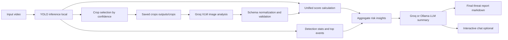

# Drone Detection LangChain App

This project runs your trained YOLO model on a local video and then exposes the detection results through a LangChain chat interface.

## What this app does

- Loads YOLO26 by default (or custom YOLO weights if provided)
- Runs frame-by-frame inference on your video
- Tracks each detected drone across frames with a persistent drone ID
- Saves an annotated output video
- Saves a structured JSON detection report
- Crops YOLO detection regions and sends them to a cloud VLM (Groq) for threat analysis
- Combines YOLO confidence with VLM threat level into a unified score
- Uses LangChain with Ollama or Groq to summarize detections and generate a final threat report

## Pipeline diagram



## Project files

- `app.py`: Main app
- `weights/best.pt` and `weights/best.onnx`: Your trained model weights
- `drone.mp4`: Example test video
- `outputs/`: Generated annotated video and JSON report

## 1) Create and activate virtual environment (Windows PowerShell)

```powershell
python -m venv .venv
.\.venv\Scripts\Activate.ps1
```

## 2) Install dependencies

```powershell
pip install -r requirements.txt
```

## 3) Optional: enable LangChain LLM backend

### Local backend with Ollama

Install Ollama, then pull a model:

```powershell
ollama pull llama3.1
```

If Ollama is not running, the app still performs video inference and JSON export, but chat will be disabled.

### Cloud backend with Groq

Set your Groq key in PowerShell:

```powershell
$env:GROQ_API_KEY="your_key_here"
```

Then run with provider and model:

```powershell
python app.py --video drone.mp4 --llm-provider groq --llm-model llama-3.3-70b-versatile --vlm-provider groq --vlm-model meta-llama/llama-4-scout-17b-16e-instruct
```

## 4) Run inference with default weights

```powershell
python app.py --video drone.mp4 --skip-chat
```

This automatically checks for `weights/best.pt` (your local YOLO26 weights) and uses it if found. If not found, it downloads and uses `yolo26n.pt`.

## 5) Run inference with other weights

```powershell
python app.py --weights weights/best.onnx --video drone.mp4 --skip-chat
```

## 6) Run inference with ONNX weights

```powershell
python app.py --weights weights/best.onnx --video drone.mp4
```

## 6) Full cloud pipeline (YOLO + Groq VLM + Groq LLM)

```powershell
$env:GROQ_API_KEY="your_key_here"
python app.py --video drone.mp4 --skip-chat --llm-provider groq --llm-model llama-3.3-70b-versatile --vlm-provider groq --vlm-model meta-llama/llama-4-scout-17b-16e-instruct --vlm-max-crops 12 --vlm-min-yolo-conf 0.35
```

## Useful options

- `--conf 0.30` set confidence threshold
- `--device cpu` force CPU
- `--tracking` enable tracking across frames (default)
- `--no-tracking` disable tracking if needed
- `--tracker bytetrack.yaml` choose tracker config (`bytetrack.yaml` or `botsort.yaml`)
- `--llm-provider ollama|groq|none` choose LLM backend
- `--llm-model llama3.1` choose local Ollama model
- `--llm-model llama-3.3-70b-versatile` example Groq model
- `--groq-api-key your_key` optional Groq key argument (env var is recommended)
- `--vlm-provider groq|none` choose cloud VLM backend
- `--vlm-model meta-llama/llama-4-scout-17b-16e-instruct` example Groq vision model
- `--vlm-max-crops 12` max number of detection crops sent to VLM
- `--vlm-min-yolo-conf 0.35` minimum YOLO confidence for VLM crop selection
- `--crop-dir outputs/crops` folder for cropped detection images
- `--llm-model none` disable LLM usage
- `--skip-chat` skip interactive Q&A

Example:

```powershell
python app.py --video drone.mp4 --conf 0.35 --skip-chat --vlm-provider groq --llm-provider groq
```

Tracking-focused example:

```powershell
python app.py --video drone.mp4 --tracking --tracker bytetrack.yaml --skip-chat
```

## Outputs

By default, files are saved to:

- `outputs/drone_annotated.mp4`
- `outputs/detection_report.json`
- `outputs/final_threat_report.md`
- `outputs/crops/`

## Notes

- If you trained only one class (drone), class statistics will typically show one label.
- ONNX inference can be slower or faster depending on your machine and runtime setup.
- Unified score formula: `0.55 * YOLO_confidence + 0.45 * (threat_level_score * VLM_confidence)`.
